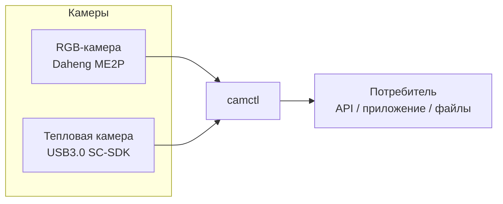
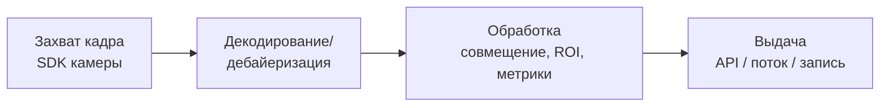

# Архитектура: обзор

> Статус: черновик
> Обновлён: 2026-06-26
> Автор:

Высокоуровневая картина системы: из чего состоит, как течут данные, на каких
принципах построена. Детали по компонентам — в [components.md](components.md),
обоснования решений — в [decisions/](decisions/).

## Контекст системы

_Кто/что взаимодействует с camctl снаружи._

## Потоки данных

Базовый конвейер: **захват → обработка → выдача**.

_Опишите словами: где буферизация, где синхронизация RGB и тепла, где
преобразование форматов, что происходит при потере кадра._

## Слои / уровни

| Слой | Ответственность |
|------|-----------------|
| Драйверы устройств | Обёртки над SDK камер (gxipy, SC-SDK) |
| Ядро захвата | Управление потоками, буферы, lifecycle устройства |
| Обработка | Преобразование форматов, совмещение, метрики |
| Интерфейс | API/CLI для потребителей (см. [../03-api/](../03-api/)) |

## Ключевые архитектурные принципы

_Несколько правил, которым следуем сознательно._

- Абстрагировать конкретный SDK за общим интерфейсом устройства (RGB и тепло — за
  одним контрактом, где возможно).
- ...

## Открытые вопросы

- Язык/рантайм основного сервиса: Python (как `Test.py`) или C++ (как драйверы)? → ADR.
- Транспорт выдачи кадров? → ADR, см. [../03-api/overview.md](../03-api/overview.md).
- ...

## Связанные документы

- Компоненты: [components.md](components.md)
- Решения (ADR): [decisions/README.md](decisions/README.md)
- Требования: [../01-requirements/functional.md](../01-requirements/functional.md)
