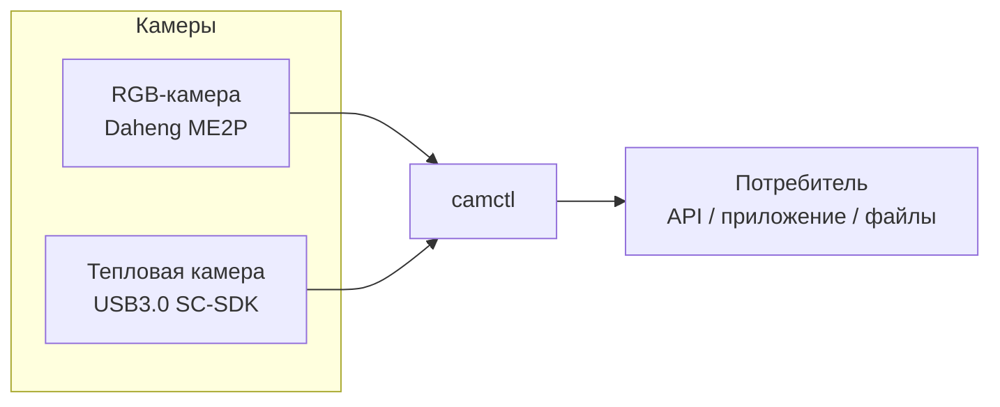
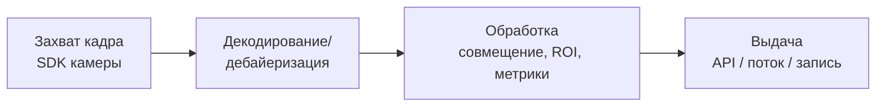

# Архитектура: обзор

> Статус: черновик
> Обновлён: 2026-06-26
> Автор:

Высокоуровневая картина системы: из чего состоит, как текут данные, на каких
принципах построена. Детали по компонентам — в [components.md](components.md),
обоснования решений — в [decisions/](decisions/).

## Контекст системы

_Кто/что взаимодействует с camctl снаружи._

## Потоки данных

Базовый конвейер: **захват → обработка → выдача**.

_Опишите словами: где буферизация, где синхронизация RGB и тепла, где
преобразование форматов, что происходит при потере кадра._

## Слои / уровни

| Слой | Ответственность |
|------|-----------------|
| Драйверы (`camera/`) | C++-обёртки над нативными SDK (`libgxiapi`, GuideUSBCamera); надзорный reconnect |
| Ядро/буфер (`core/`) | Frame, буфер latest-wins, время, конфиг, лог |
| Кодек (`encode/`) | H.264 через NVENC (V4L2 M2M) |
| Стриминг (`stream/`) | RTP (RFC 6184) + минимальный RTSP |
| Управление (`control/`) | TCP + JSON, реестр параметров, пресеты (см. [../03-api/](../03-api/)) |

## Ключевые архитектурные принципы

_Несколько правил, которым следуем сознательно._

- Абстрагировать конкретный SDK за общим интерфейсом устройства (RGB и тепло — за
  одним контрактом, где возможно).
- ...

## Решённое

- **Язык релиза — C++** (максимальный контроль и скорость ради низкой задержки) —
  см. [decisions/0003-service-language-cpp.md](decisions/0003-service-language-cpp.md).
  Python-скрипты (`Test.py`, `viewer_qt.py`, `guide_thermal.py`) — **только прототип** для
  проверки камер, в релиз не входят.
- Транспорт видео — RTSP/RTP + H.264, свой стек на NVENC (V4L2), см.
  [decisions/0002-streaming-transport.md](decisions/0002-streaming-transport.md),
  [decisions/0004-streaming-inhouse-nvenc.md](decisions/0004-streaming-inhouse-nvenc.md).
- Управление — TCP + JSON, см.
  [decisions/0006-control-protocol-tcp-json.md](decisions/0006-control-protocol-tcp-json.md).
- Развёртывание — процесс на камеру, см.
  [decisions/0005-process-per-camera.md](decisions/0005-process-per-camera.md).

## Открытые вопросы

- Синхронизация RGB и тепла (временные метки, совмещение).
- ...

## Связанные документы

- Компоненты: [components.md](components.md)
- Решения (ADR): [decisions/README.md](decisions/README.md)
- Требования: [../01-requirements/functional.md](../01-requirements/functional.md)
